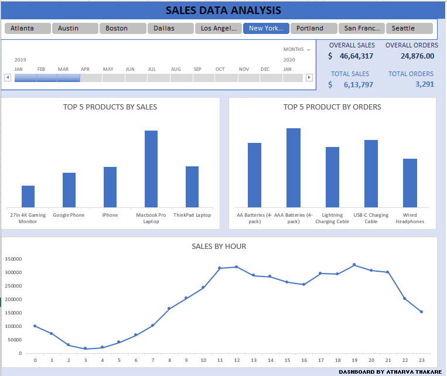

# 📊 Sales Data Analysis Dashboard

### 🎯 Objective
To analyze sales data across multiple cities and identify key products, time trends, and revenue opportunities that can drive business growth.

---

### 🧰 Tools Used
- **Microsoft Excel**
  - Pivot Tables  
  - Charts  
  - Slicers  
  - Data Cleaning & Analysis

---

### 🧠 Dataset Columns
`Sr No`, `Order ID`, `Product`, `Quantity Ordered`, `Price Each`, `Order Date`, `Purchase Address`, `Month`, `Sales`, `City`, `Hour`

---

### 📈 Key Insights
- 💻 **Top 5 products** contributed to more than **50% of total sales**, with **MacBook Pro Laptop** generating the **highest revenue** across all cities, followed by **iPhone**.  
  → These are **high-profit products**, so the business should prioritize them to increase revenue.  
- 🔋 The most **frequently ordered products** were **AAA Batteries** and **AA Batteries**, indicating strong recurring demand — these should be kept **readily available in bulk** across all stores.  
- ⏰ **Peak sales** occurred between **10 AM and 8 PM**, which is the **ideal time for launching marketing campaigns and ads** to maximize conversions.  
- 🏙️ **San Francisco** recorded the **highest total sales**, making it a key target region for promotions and customer engagement.

---

### 📸 Dashboard Preview

---

### 👨‍💻 Created By
**Atharva Thakare**  
*Aspiring Data Analyst | Excel | SQL | Power BI | Python (Beginner)*  
🔗 [GitHub Profile](https://github.com/atharva-thakare)

